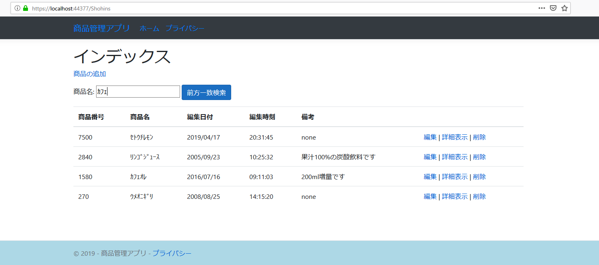
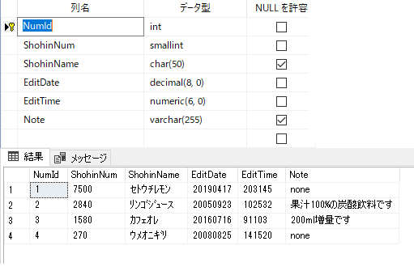

### :octocat: ASP.NET CoreでEntityFramework Coreを使いSQLServerとの読み書きサンプル
___
#### 環境
```
開発環境：Microsoft Visual Studio 2019 Community Edition 16.7.5  
フレームワーク：ASP.NET Core MVC 3.1.8  
デベロッパーパック：.NET Core SDK 3.1.402  
Webサーバー：IIS(Internet Information Services) Express 10.0.04403  
言語：C#.NET 8.0  
テンプレートエンジン：Razor View  
データベース：Microsoft SQL Server 2019 Express CU8  
-データベース管理ツール：Microsoft SQL Server Management Studio 18.6  
データベース接続：.NET Framework Data Provider for SQL Server
O/R マッパー：Entity Framework Core SQLServer 3.1.8  
CSSテンプレート：Bootstrap 4.3.1  
JavaScriptライブラリー：JQuery 3.5.1
```

#### 画面・イメージ
  

#### データベース・イメージ
  